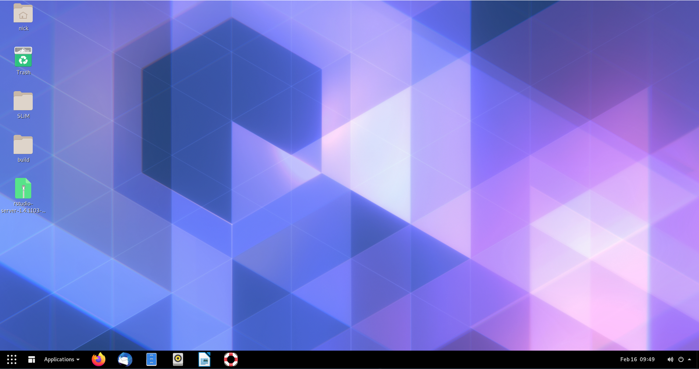

# Installing a Linux environment & SLiM on the WSL

## Overview

SLiM was built primarily with MacOS in mind, so no native Windows version exists. However, a Linux version is around. 
We can use Windows 10's new Windows subsystem for Linux (WSL) to run SLiM on Windows (or if we want to be pedantic, we're running 
SLiM on a Linux kernel running off Windows). The [SLiM manual](http://benhaller.com/slim/SLiM_Manual.pdf) 
has a pretty good step-by-step instruction for this if you want to run SLiM by itself, and not worry about using WSL for anything else. 
However, Linux is a fantastic base for many scientific applications, such as connecting to supercomputers, which are more often 
than not Linux-based. As such, I'll be guiding you through installing a desktop environment for WSL, installing R, RStudio, and SLiM, 
and getting you up to speed with some basics of using Linux. For MacOS users, you can simply install SLiM using the installer package 
available [here](https://messerlab.org/slim/). There are also instructions in the SLiM manual for building SLiM from source for MacOS 
if you would prefer to do that. For Windows users not on Windows 10, I'm afraid there is no way at the moment to run SLiM "natively" on 
Windows - your best bet would be to dual boot a Linux distribution, or run a virtual machine with VirtualBox or VMware. 

::::{.extrabox data-latex=""}
:::{.center data-latex=""}
**Box 2.1.1**
:::

Linux (or any Unix based operating system, such as MacOS) differs from Windows in the sense that absolutely everything is treated as a file - 
including devices like printers or monitors. These devices have specialised files that store information about that device. 
Programs can read those files (or write to them) to communicate with the device itself. Note that these aren't files in the sense that 
they are a .txt or something, but they are exposed to the filesystem in the same way and can be treated differently depending on what commands you give it.

For example, you could enter 

```bash
cat /proc/cpuinfo

```

or 


```bash
gedit /proc/cpuinfo
```

to print your CPU information to the terminal, or open the file with a text editor so it is readable.

You can also use various 'files' such as /dev/null or /dev/urandom to instruct other commands. Redirecting output from a command 
to /dev/null will silence the output so it isn't displayed in the terminal:


```bash
slim ~/PolygenicSLiM/box2.1.slim # With output
```

```
## // Initial random seed:
## 1672584688534
## 
## // RunInitializeCallbacks():
## initializeMutationRate(1e-07);
## initializeMutationType(1, 0.5, "f", 0);
## initializeGenomicElementType(1, m1, 1);
## initializeGenomicElement(g1, 0, 999);
## initializeRecombinationRate(1e-08);
## 
## // Starting run at generation <start>:
## 1 
## 
## Look at this messy output!
```

```bash
slim ~/PolygenicSLiM/box2.1.slim > /dev/null # Output nullified
```

/dev/urandom will generate pseudorandom numbers:

```bash
od -d /dev/urandom | head # Generate random decimal integers
```

```
## 0000000 26372 15163 29812 62227 53873 10092 12756 46217
## 0000020 55648 60683 44304 22320 64690 50501 57432 35435
## 0000040 15351 11429 46353  8458 13392 31922 61546 11346
## 0000060 37762 43081   475 52369 35470 35555 33724 22586
## 0000100 27048 31030 21457 12312 34059 57622 47664 31446
## 0000120 22321 21302  2002 25394    13 35812 12402 39315
## 0000140 25964   147 48696 34464 53465 39348 21430 14041
## 0000160 51129  5024 25816  9021  8300 41428 43725 52696
## 0000200 34758 27805 35483 43161  6096 42004 39958 44553
## 0000220  5531 50736 51174 52377 61337 16584 50826 62860
```

The power of having these very specific commands which can act on a lot of different types of files is that Linux users can 
chain together these commands to efficiently solve a larger problem.
::::

## Why Linux?

To many people, the term 'Linux user' is analogous to 'computer wizard' or 'weirdo'. Unfortunately for you, future weirdo, 
Linux is an incredibly helpful tool for scientific applications. I've already mentioned that SLiM doesn't run on Windows natively, 
but that is far from the only scientific program that requires (or runs better on) a Linux operating system. Although user-friendly, 
both Windows and MacOS are extremely bloated, meaning that just running the operating system requires a massive amount of memory 
and CPU resources _that your other applications cannot use_. Linux is a barebones system, with the idea being that the user can build 
the operating system how they want by installing only the features that they will use, saving memory and processor power for the 
tasks at hand. Another reason for Linux's speed and low memory footprint is its way of storing files (as mentioned in Box 2.1.1), 
which is very different to Windows. It takes a bit of getting used to, but in the end you will save massive amounts of time using Linux 
versus Windows or MacOS. However, there are still programs that you might need to run in Windows because there is no Linux or Mac version. 
There are three options in this case:

- Dual-boot by installing a Windows and Linux operating system on separate hard drives (or partitions on one hard drive), 
- Use a traditional virtual machine such as VMware or VirtualBox, 
- Use the Windows 10 Subsystem for Linux (WSL). 

Dual-booting is great if you rarely use one of your installed operating systems, but generally a bit of a pain if you're constantly 
wanting to switch between using Windows and Linux software (you can only run one OS at a time, so you need to reboot if you want to 
use software in the other OS). VMware and VirtualBox tend to be very resource-intensive, which negates the speed advantage you get from 
running Linux over Windows. WSL, however, is much faster, and simple to set up.

## The Windows Subsystem for Linux

Windows 10 introduced a new way to emulate a Linux machine via a Windows operating system, WSL. The advantage of this approach is 
accessing your data between operating systems is very easy: your Windows files are visible in Linux, and you can save files to your 
Windows machine directly using Linux programs. This way, you can use Linux commands such as sed and grep to filter output 
(extremely quickly) and directly save the output to files that Windows programs can read! Hence, we can run SLiM simulations, 
storing the output wherever you want, and then use Windows to do data analysis (although you could do that analysis in Linux also). 
Below, I'll provide some instructions for installing WSL 2, a Linux distribution (Ubuntu 20.04), and some basics for getting started with Ubuntu.


## Installing WSL

There are two choices for running WSL: WSL 1 or WSL 2. Both are fairly similar in speed, however WSL 2 uses a real Linux kernel 
and an extremely fast virtual machine (along with a virtual hard drive), whereas WSL 1 used a translation layer (instead of a native kernel) 
to translate between windows and a linux distribution. Ultimately , the main difference is WSL 2 is slightly slower when it comes 
to copying files between Windows and Linux, but faster nearly everywhere else. Although both versions run SLiM fine[^fn2], I'll be opting for WSL 2.


To install WSL, you'll need to be on Windows 10 version 1903 (build 18362) or newer. To check your version number, run winver.exe. 
This will tell you the version and build number (build number being in brackets).

Instructions for installing WSL 2 can be found on the [Microsoft website here](https://docs.microsoft.com/en-us/windows/wsl/install-win10). 
You'll want to install Ubuntu 20.04 LTS, which can be found on the Microsoft Store (for free).

This will install your Linux distribution to the C:/ drive by defualt. If you have limited space on C:/ you can move it to an 
alternative drive, using [this tool](https://github.com/pxlrbt/move-wsl). I recommend installing [git bash on Windows](https://gitforwindows.org/) 
and running it that way. A side effect of moving your Linux installation is the default user is replaced by root (basically admin for Linux) 
for some reason, but this is easy enough to fix. 
In your Ubuntu terminal, open up /etc/wsl.conf with nano and add the following to the end of the file:

```bash
# Open wsl.conf with the nano text editor, using administrator permissions
sudo nano /etc/wsl.conf

# Add the following lines to the bottom of wsl.conf

[user]
default=YOUR_USERNAME
```
If wsl.conf doesn't exist, create the file manually with `sudo touch /etc/wsl.conf`. After you've added that line, close Ubuntu, then in PowerShell run: 


```powershell
wsl -terminate Ubuntu
```

When you next open Ubuntu, you should login as your user again. If that doesn't work, open up PowerShell and enter:

```powershell
ubuntu config --default-user YOUR_USERNAME
```

Congratulations! You now have a working version of Ubuntu 20.04 LTS running via Windows 10.


## Installing a desktop and setting up X11

At this point you have a Ubuntu terminal which you can use to input commands. This is perfectly usable 
(even with a desktop you'll be using the terminal quite a bit), but you'll probably want a desktop environment to be more comfortable.
To do this, enter the following:


```bash
sudo apt-get update # Refresh Ubuntu's list of software updates
sudo apt-get upgrade # Download and install package updates
sudo apt install ubuntu-desktop gnome
```

::::{.extrabox data-latex=""}
:::{.center data-latex=""}
**Box 2.3.1**
:::
While we'll be installing GNOME for this installation, there are a number of other desktop environments you may want 
to have a look at if you aren't happy with how GNOME looks or performs on your system. Some others to have a look at 
are xfce4, Plasma, Unity, MATE, and Budgie. Window managers like dwm or i3 are also good for advanced users, however 
they are barebones and will likely require more tinkering to get to a form you like.
::::


The first two commands will update your base installation and packages; the third will install GNOME 
(a Linux desktop environment) and relevant dependencies. 

While those files are downloading, you'll need to grab a X11 program for Windows. X11 is how Linux draws graphics, 
so we need that so that when you run GNOME, Linux has a window to draw your desktop. I recommend [VcXsrv](https://sourceforge.net/projects/vcxsrv/), 
which is easily configurable.

After downloading and installing VcXsrv and GNOME, there's a little workaround to get it working on WSL.
In the Ubuntu terminal enter the following:


```bash
sudo nano ~/.bashrc # Open up .bashrc in the nano text editor

# .bashrc contains commands that run on startup
# Add this one to the bottom of the file in nano and press ctrl+o to save and ctrl+x to exit

export LIBGL_ALWAYS_INDIRECT=0

```

This has something to do with how Linux handles OpenGL graphics drivers, but that's about as much depth into it as I can go. 
Without doing this, SLiMgui doesn't render properly. Next, there's a setting that needs to be enabled which defaults to disabled in WSL. 
In WSL 1, this broke a lot of programs (particularly compilers), but it seems to work fine in WSL 2. 
In Terminal, enter:

```bash
git clone https://github.com/DamionGans/ubuntu-wsl2-systemd-script.git
cd ubuntu-wsl2-systemd-script/
bash ubuntu-wsl2-systemd-script.sh
logout
```

Now your Ubuntu window should close. Again, go to PowerShell and terminate Ubuntu:

```powershell
wsl -terminate Ubuntu
```

Next, open up VcXsrv. You should be greeted with a panel that looks something like this:


Choose "One large window" and click next, and then next again.
At this dialogue, in additional parameters type -ac


After pressing next, you should be done! You can save your configuration to create a shortcut that will open VcXsrv with your settings. 


Click Finish and VcXsrv will open a blank window. Open ubuntu and enter:

```bash
gnome-session
```

In a few seconds your VcXsrv window should be populated! 


Each time you start Ubuntu and your X11 server, remember to run `gnome-session` to enable your desktop. 
An alternative to this is to create a startup script that automatically runs `gnome-session` whenever you start Ubuntu.

Now you might notice that your desktop doesn't look exactly like my example above. GNOME is quite customisable, 
and a plethora of user extensions to personalise your desktop. I won't cover that here, but I would recommend 
checking out the [GNOME extensions website](https://extensions.gnome.org/), and searching around for some GNOME themes. 
One extension I do recommend installing is nautilus admin, which will allow you to right click in any folder to open 
a terminal there - a great convenience!


```bash
sudo apt install nautilus-admin

# An alternative if that doesn't work is

sudo apt install nautilus-extension-gnome-terminal
```


## Building SLiM

There's a few ways of going about building SLiM. We'll be following the Linux/Unix installation instructions 
(Chapter 2.2.1) in the [SLiM manual](http://benhaller.com/slim/SLiM_Manual.pdf). First, install the following packages:

```bash
sudo apt-get update
sudo apt install -y build-essential cmake qt5-default qt5-qmake mesa-utils
sudo apt install -y libgl1-mesa-glx x11-apps
```

After this, you should have all the dependencies you need to run the installation script mentioned in the manual:

```bash
wget -o - --quiet https://raw.githubusercontent.com/MesserLab/SLiM-Extras/master/installation/DebianUbuntuInstall.sh | sudo bash -s
```

This will download and install SLiM, Eidos, and SLiMgui on your system.
You should be able to find SLiMgui in your applications now, and you'll have something looking like this:
<a href="./images/chapter2/slimgui.PNG" target="_blank"></a>

::::{.extrabox data-latex=""}
:::{.center data-latex=""}
**Box 2.4.1**
:::
What are all these dependencies that you've installed to install SLiM? Why do I need all that when on Windows 
you just open an installer? On Linux, a fair few packages are 'built from source'. This means that the program's 
source code is available for download, which means that the user can download that and compile it into an 
application, while being able to poke around and make adjustments to the software if they want. What the SLiM 
installer script does is run a series of commands to compile SLiM's source code into machine code (1s and 0s), 
which are treated as an application. The applications you installed are the commands which are used to 
install SLiM: build-essential includes a bunch of compilers to translate human-written code to binary, cmake is 
a tool to generate makefiles (which are used to tell the compiler how to link certain parts of the code with others, 
and generally make compiling possible on large projects), qt5 is a graphics framework for drawing windows 
(such as the SLiMgui window), qmake is a makefile generator specifically for qt projects, and mesa-utils, libgl1-mesa-glx, 
and x11-apps provide tools to test that X11 and video drivers are working properly.

The concept of software compilation is fascinating, so I will leave a link [here](https://www.youtube.com/watch?v=9mZw6Rwz1vg) 
for anyone interested in learning more. 
::::


## Installing other useful apps

When using SLiM, you'll need some more apps to run SLiM on remote computers and to analyse data.
I recommend installing FileZilla, which will help copy files across from your computer to a remote supercomputer:

```bash
sudo apt install filezilla
```

For analysis, I recommend installing R, which is a tiny bit more involved.

```bash
cd /etc/apt
sudo gedit ./sources.list

# Add the following line to sources.list

deb https://cloud.r-project.org/bin/linux/ubuntu focal-cran40/
```

Then, in terminal enter the following:

```bash
sudo apt-get update
sudo add-apt-repository 'deb https://cloud.r-project.org/bin/linux/ubuntu focal-cran40/'
sudo apt-key adv --keyserver keyserver.ubuntu.com --recv-keys E298A3A825C0D65DFD57CBB651716619E084DAB9
sudo apt install r-base r-base-core r-recommended r-base-dev
```

This will install the latest release of R 4.0, along with some packages.
Next, we can install RStudio: you can choose to install it as an app or as a server, which you can connect 
to via your internet browser in both Windows and Linux. With some more set up, you could also remotely 
connect to it via the internet, but I'll leave that for later. 

To install RStudio as an app: 

```bash
sudo apt install gdebi-core

wget https://download1.rstudio.org/desktop/bionic/amd64/rstudio-1.4.1103-amd64.deb && sudo gdebi rstudio-1.4.1103-amd64.deb
```

Then you can run `rstudio` to open the app.

To install RStudio as a server app:

```bash
wget https://download2.rstudio.org/server/bionic/amd64/rstudio-server-1.4.1103-amd64.deb
sudo gdebi rstudio-server-1.4.1103-amd64.deb
```

Launch RStudio by running `rstudio-server start`, and stop the the service with `rstudio-server stop`.
The default settings allow you to connect to the server using whichever browser you'd like with the url
`localhost:8787`. You'll have to login using your Linux username and password. Note that this server is running on your local machine, 
so to connect to your server on a different network, you'll have to do some network configuration (namely port forwarding and setting a static IP).

When you have RStudio running (or R if you are just running from the Terminal using `R` like a madman), 
you can use `install.packages("PACKAGE_NAME")` to install packages. Necessary packages will be detailed in later 
chapters when we get to needing them. To start, try `install.packages("tidyverse")`.

Another nice piece of software is Visual Studio Code. This is a lightweight version of Microsoft's Visual Studio IDE 
containing just the text editor. It has really good language tools for a variety of popular languages including Python, 
R, and C-based languages. For non-SLiM code, this is what I prefer to write in. Another bonus is you can install VS Code 
for Windows and have it communicate with your WSL installation using the Remote-WSL extension, or you can install it for 
Linux and run it from in there. Either way, you can download it from the [Visual Studio website](https://code.visualstudio.com/). 
If you want to install it on Ubuntu, make sure you download the .deb; you can use:


```bash
# Make a Installers directory in your /home/ if you don't have one
mkdir ~/Installers

cd ~/Installers
sudo wget https://code.visualstudio.com/sha/download?build=stable&os=linux-deb-x64
sudo dpkg -i code_*

```
The `*` is a wildcard that means 'anything': so any file that starts with code_ will be selected 
(which there should only be one of, the installer you just downloaded with wget). `dpkg -i` is a command 
to extract and process a debian package, with -i meaning to install it to root (rather than just to the current folder).

You can open VS Code without opening a file, using `code .`
When you load VS Code from your WSL Ubuntu installation, you'll get a message warning you that you should 
install it on Windows instead. It stills works perfectly fine on Linux, you just have to press Y to accept 
the message that appears:


If you want to install VS Code on Windows and connect remotely to your Ubuntu distribution (you'll still 
have access to the Terminal etc.), you can download the installer for Windows from the [Visual Studio website](https://code.visualstudio.com/) 
and install as usual. From there, you can install the [Remote-WSL extension](https://marketplace.visualstudio.com/items?itemName=ms-vscode-remote.remote-wsl), 
which will run the VS Code UI on Windows, but all the inner workings on Linux, giving you access to all of the 
useful tools Linux provides (such as Clang and gcc if you are working with a compiled language).

When you work with VS Code, it will automatically detect what language your code is based on the filename. 
For example, if you save a file as .py, VS Code will ask if you want to install a language extension for Python, 
which will give you access to autocomplete and error checking a la a full-fat IDE. There is no SLiM/Eidos extension, 
but it is possible to make custom language extensions. Regardless, this might not be the best way to program for SLiM 
considering SLiMgui gives immediate, visual feedback on the behaviour of the model by running it in real time and 
showing mutation frequency dynamics, which VS Code would lack.

Congratulations! You now have a Linux desktop, SLiM, RStudio, VSCode and FileZilla installed and ready to go 
for exploring polygenic adaptation using computer simulations!
<a href="./images/chapter2/desktopapps.PNG" target="_blank"></a>

## Footnotes
[^fn2]: One bug I did find with WSL 1 was that Windows Security seems to treat a few programs running on Linux as something suspicious. 
The result is that Windows Security uses 50% or more CPU while those programs are running. SLiM is included in this, so if for whatever 
reason you use WSL 1, remember to turn off real-time protection during your SLiM runs and then _remember to turn it back on when the run is finished_.
