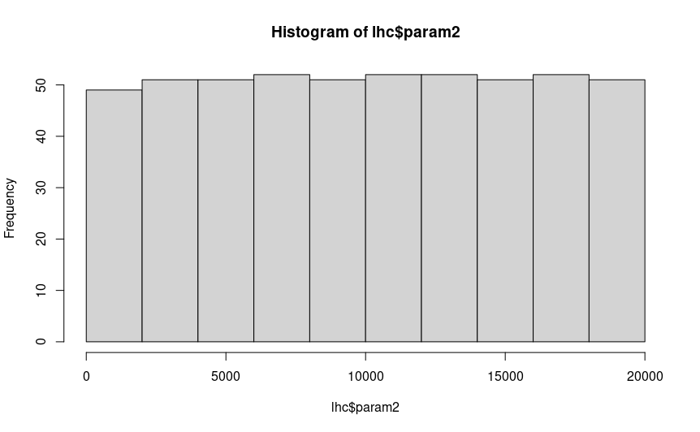

# Latin Hypercube Sampling

## Overview

When we add a lot of parameters to an experimental design, a problem appears: in order to 
measure each parameter's effect across a range of parameter levels or values, you must increase the 
number of experiments exponentially. For example, to sample two parameters with two levels each, 
you need four treatments to measure them all. With three parameters with two levels each, you need
eight treatment groups. By the time you're at six parameters, you need 64 groups, and that's just with 
two treatment levels each. How do you effectively sample this parameter space well then? Latin hypercube
sampling offers a potential solution. 

## What is Latin hypercube sampling?

In Latin hypercube sampling (LHC), a continuous range of each variable is specified, and combinations
of these parameters are sampled together. The idea is to sample parameter combinations, which when taken 
together explain the total parameter space (possible values for each parameter) while minimising 
correlations between sampled variables (so as to avoid collinearity between factors).

## Generating hypercubes in R

To generate LHCs in R, you can use the `DoE.wrapper` package, which nicely wraps a bunch of
LHC methods from `LHS` into an easy and user-friendly interface.


```r
# Script to generate a Latin hypercube for two parameters
library(DoE.wrapper)

# Sample a random 32 bit int as a seed for the LHC generation
lhc_seed <- sample(0:.Machine$integer.max, 1)

# In the example in chapter 8, this is 1868057774
lhc <- lhs.design(
  nruns = 512,
  nfactors = 2,
  type = "maximin",
  factor.names = list(
    param1 = c(0.0, 1.0),
    param2 = c(100, 20000)),
  seed = lhc_seed
)
# Diagnostics
# Plot param1 against param2 to visualise any obvious gaps in sampling and correlations
plot(lhc)

# Return a matrix of correlations between factors
cor(lhc)

# Plot the histograms to check uniformity
hist(lhc$param1)
hist(lhc$param2)

# Save the output to file
write.csv(lhc, "./LHC.csv")
```

The `lhs.design` function creates a Latin hypercube of `nruns` samples, with `nfactors` factors/columns.
You can choose a method for sampling your parameter combinations with `type`. I find that most of the time 
`maximin` is best suited to generate LHCs with maximised spaced between samples and minimised correlations
between factors. `factor.names` is used to specify a list of factor names, and the minimum and maximum values
to sample from. For example, here `param1` will be sampled from 0 to 1. 
The function will output a dataframe, which you can save as a file to load and reference later.
It's a good idea to run some diagnostics on your hypercube when its done before you go to use it. You're looking for 
even spacing between samples (no obvious large gaps in sampling) and very little correlation between parameters,
to ensure you get a good sample of all parameters' effects on your model. To do this, you can `plot` the LHC,
which will give you a pairwise matrix of parameter combinations, showing you the spread of samples in the whole
parameter space, which should look something like this:
()

You can also create histograms of each parameter to check that they are uniformly distributed with `hist()`, and
run `cor` to get the correlations between parameter pairs:




If you are satisfied that your hypercube looks uniformly distributed, there are no big gaps you aren't sampling in any of your 
parameter combinations, and there is little correlation between parameters, then you are all good to save the hypercube with
`write.csv()`.


## Running SLiM with hypercube parameters

You shouldn't have to change any of your sublauncher script to use hypercube parameters: the LHC dataframe is formatted in the 
same way as any other parameter combination dataframe. Simply load the hypercube .csv instead of combos.csv, and as long as you
select the right columns, you'll be good to go.


## Considerations

When analysing your data, there are some considerations to make: you are treating each parameter as a continuous value, and 
hypercube combinations will not be nice even numbers. It's up to you how to deal with this, but some parameters will need
truncating or rounding (such as population size, which requires an integer), or ordinal variables like the distribution of 
size effects (normal, gamma, etc.). For something like that, you can assign cut off values for each factor level (e.g. hypercube
value < 0.5 is normal, > 0.5 is gamma), or run your hypercube without those parameters, and repeat the experiment for each level 
of those ordinal variables. Note that this will exponentially increase the number of runs, as you are incorporating a level of 
factorial design to your experiment.

In addition, individual hypercube samples can be difficult to use, as they are continuous rather than discrete levels of factors.
Hence, they are better suited to be analysed as a whole rather than in sections. However, it is still possible to factorialise LHC
combinations by creating levels from ranges of values. For example, the first third of your parameter range could be assigned 'Low',
the middle third being 'Medium' and the top third being 'High'. However, it's usually not necessary to do this unless you are missing 
combinations of particular parameters, which can occur if you do not have enough samples (`nruns` in `lhs.design()`). 


## App 

I've written a little Shiny app to generate your hypercubes for you: it will show you all the diagnostic plots I have explained above,
and allow you to save the file to an arbitrary location. You can run it yourself from [`Hypercube/app.R`](https://github.com/nobrien97/PolygenicSLiMBook/blob/main/src/Hypercube/app.R)
