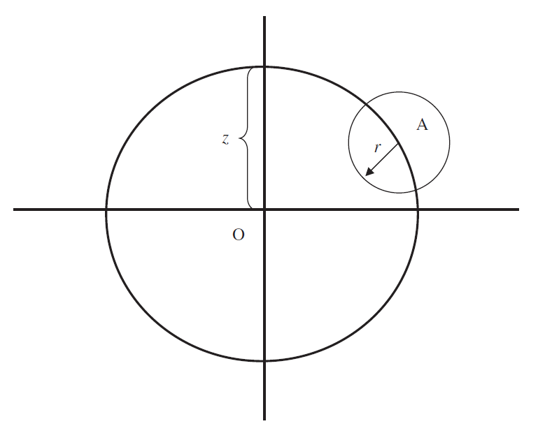

```{r setup, include=FALSE}
knitr::opts_chunk$set(echo = TRUE)
```

# A Brief Overview of Polygenic Adaptation

## Overview

Before you simulate anything it's important that you have a clear view of what's you are trying to achieve with your model. 
This makes it considerably easier to find and fix bugs/unintended behaviour within your model, as well as making it easier 
to write your model in the first place. Below I'll describe the basics of polygenic adaptation from both a quantitative and 
population genetics view, and give some examples of what SLiM models can represent with respect to these theories.


## What is polygenic adaptation?

Put simply, polygenic adaptation is the evolution of a trait controlled by multiple genes via selection. Traditional 
Mendelian genetics (or monogenic models of adaptation) assume that one gene may adapt via the emergence of new, 
fitter alleles which rapidly fix in a population (Figure - Hard sweep curve). While examples of this do exist in nature, 
it has become increasingly clear that many traits are controlled by many genes, leading to different behaviours when 
these traits are under selection. Indeed, rather than the 'hard sweep' behaviour of monogenic systems, where alleles 
rapidly increase in frequency to fixation, polygenic adaptation is instead driven by small frequency shifts at many 
loci (a soft sweep), however not necessarily the same ones for each individual in the population. Hence, there is 
greater genetic diversity maintained in populations undergoing polygenic adaptation, and potentially many haplotypes 
leading to the same or similar phenotypes.

The problem with polygenic adaptation though is that it's difficult to approach analytically. Traditional 
population genetics theory focuses on singular genes with two alleles leading to more mathematically justifiable 
predictions about allele behaviour (fitness, frequency changes etc.). With more genes, these predictions cannot 
be made analytically owing to complexity, so quantitative geneticists proposed a new method of viewing adaptation: 
rather than genes as the focal point, look at the traits instead.

## Fisher's Geometrical model of adaptation

In 1930, Ronald Fisher published a seminal paper which revolutionised the way biologists thought about adaptation[^fn2]. 
In this paper, Fisher described his geometric model of adaptation (FGM), where traits evolve by mutations which have a 
given effect on the trait. If a phenotypic optimum exists, and a population's mean phenotype starts some distance away 
from that optimum, then mutations that move a population's mean closer to that optimum phenotype are beneficial. 
Mutations that don't do this are deleterious. This model describes stabilising selection, where intermediate trait values 
(those centered around the optimum) have the highest fitness, with a Gaussian falloff in fitness occurring as the population 
gets further away from that phenotypic optimum. The FGM is extended to explain multiple traits, so that the optimum 
exists on more than one dimension. The math here remains very similar, with the stabilising selection fitness function 
becoming a multivariate normal distribution, with each mutation now pushing or pulling an individual in some n-dimensional 
direction towards or away from the optimum (where n is the number of traits).


Figure 2 - Diagrammatic representation of Fisher's geometric model, adapted from Orr, 2006. The x and y axes represent 
the phenotype space of two traits. The population, A, sits in phenotype space at the edge of the large circle. 
The distance that population A is from the phenotypic optimum is represented by z (with the optimum represented by O). 
Mutations can arise that move the population closer or further away from O, and those mutations can be of variable size. 
The smaller circle represents this. A given mutation may move the population r units in some direction away from their 
present location. Rarely will a mutation be beneficial (moving the population closer to the optimum). Most of the time, 
a mutation's direction will be away from the optimum, and thus it will be lost by background selection.

This means that the fitness of a given mutation in polygenic systems is dependent on its background: If a mutation overshoots 
the optimum (which can happen if that mutation has large effect), it would ordinarily be considered deleterious. 
However, if a number of other mutations exist which move the population in the opposite direction, that mutation in the 
context of its genetic background is more favoured. 

But how would we expect mutations to be distributed? Theoretical expectations assume that traits are normally distributed, 
owing to the central limit theorem. Lande's (1976, 1980, 1983) models assume effect sizes are normally distributed. 
Fisher's original FGM had mutations of a fixed size (as shown in figure 2, r). Mostly, mutational size distributions 
appear to be normal or gamma distributed, however the distributions of sizes of substitutions are consistently exponential 
(Orr, 2006). This indicates a small number of large effects contributing to the phenotype, and many smaller effects - 
a pattern which has been validated with theoretical, simulation, and empirical data.


# References
[^fn2]: Fisher, R. A. (1930). The genetical theory of natural selection. Clarendon Press. https://doi.org/10.5962/bhl.title.27468