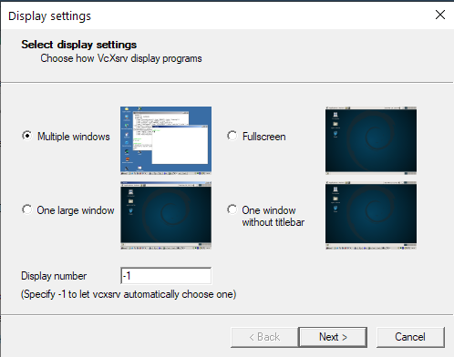

```{r setup, include=FALSE}
knitr::opts_chunk$set(echo = TRUE)
```

## 2.1 Overview

SLiM was built primarily with MacOS in mind, and so no native Windows version exists. However, since MacOS is very similar to many Linux distributions, we can use Windows 10's new Windows subsystem for Linux to run SLiM on Windows (or if we want to be pedantic, we're running SLiM on a Linux kernel running off Windows). The SLiM manual (SOURCE) has a pretty good step-by-step instruction for this if you want to run SLiM by itself, and not worry about using WSL for anything else. However, Linux is a fantastic base for many scientific applications, such as connecting to supercomputers, which are more often than not Linux-based. As such, I'll be guiding you through installing a desktop environment for WSL, installing R, Rstudio, and SLiM, and getting you up to speed with some basics of using Linux. For MacOS users, you can simply install SLiM using the installer package available [here](https://messerlab.org/slim/). There are also instructions in the SLiM manual for building SLiM from source for MacOS if you would prefer that. For Windows users not on Windows 10, I'm afraid there is no way at the moment to run SLiM "natively" on Windows - your best bet would be to dual boot a Linux distribution, or run a virtual machine with VirtualBox or VMware). 

::::{.extrabox data-latex=""}
:::{.center data-latex=""}
**Box 2.1**
:::

Linux (or any Unix based operating system) differs from Windows in the sense that absolutely everything is treated as a file - including devices like printers or monitors. These devices have specialised files that stores information about that device. Programs can read those files (or write to them) to communicate with the device itself. Note that these aren't files in the sense that they are a .txt or something, but they are exposed to the filesystem and can be treated as different files depending on what commands you give it.

For example, you could enter 
```{bash files, eval=FALSE}
cat /proc/cpuinfo

```

or 

```{bash files2, eval=FALSE}
gedit /proc/cpuinfo
```

to print your CPU information to the terminal, or open the file with a text editor so it is readable.

You can also use various 'files' such as /dev/null or /dev/urandom to instruct other commands. Redirecting output from a command to /dev/null will silence the output so it isn't displayed in the terminal:

```{bash devnull}
slim ~/PolygenicSLiM/box2.1.slim # With output
```
```{bash devnull2}
slim ~/PolygenicSLiM/box2.1.slim > /dev/null # Output nullified
```

/dev/urandom will generate pseudorandom numbers:
```{bash devrandom}
od -d /dev/urandom | head # Generate random decimal integers
```

The way you can interface directly with devices using common base commands makes linux really powerful, and since each command is so specific, chaining them together becomes fast and powerful.
::::

## 2.2 Installing WSL

There are two choices for running WSL: WSL 1 or WSL 2. Both are fairly similar in speed, however WSL 2 uses a real Linux kernel and an extremely fast virtual machine (along with a virtual hard drive), whereas WSL 1 used a translation layer (instead of a native kernel) to translate between windows and a linux distribution. Ultimately , the main difference is WSL 2 is slightly slower when it comes to copying files between Windows and Linux, but faster nearly everywhere else. Although both versions run SLiM fine, I'll be opting for WSL 2.

To install WSL, you'll need to be on Windows 10 version 1903 (build 18362) or newer. To check your version number, run winver.exe. This will tell you the version and build number (build number being in brackets).

Instructions for installing WSL 2 can be found on the Microsoft website [here](https://docs.microsoft.com/en-us/windows/wsl/install-win10). You'll want to install Ubuntu 20.04 LTS.

This will install your Linux distribution to the C:/ drive by defualt. If you have limited space on C:/ you can move it to an alternative drive, using [this](https://github.com/pxlrbt/move-wsl) tool. I recommend installing git bash on Windows and running it that way. A side effect of this is the default user is replaced by root (basically admin for linux) for some reason, but this is easy enough to fix. 
Open up /etc/wsl.conf with gedit and add the following to the end of the file:
``` {bash rootfix0, eval = FALSE}

gedit /etc/wsl.conf

# Add the following lines to the bottom of wsl.conf

[user]
default=YOUR_USERNAME
```
If wsl.conf doesn't exist, create the file manually. After you've added that line, close Ubuntu, then in PowerShell run: 

```{powershell wslterminate, eval = FALSE}
wsl -terminate Ubuntu
```

When you next open Ubuntu, you should login as your user again. If that doesn't work, open up PowerShell and enter:
``` {powershell rootfix, eval = FALSE}
ubuntu config --default-user YOUR_USERNAME
```

Congratulations! You now have a working version of Ubuntu 20.04 LTS running via Windows 10.


## 2.3 Installing a desktop and setting up X11

At this point you have a Ubuntu terminal which you can use to input commands. This is perfectly usable (even with a desktop you'll be using the terminal quite a bit), but you'll probably want a desktop environment to be more comfortable.
To do this, enter the following:

``` {bash gnomeinstall1, eval=FALSE}
sudo apt-get update # Refresh Ubuntu's list of software updates
sudo apt-get upgrade # Download and install package updates
sudo apt install ubuntu-desktop gnome
```

The first two commands will update your base installation and packages; the third will install GNOME (a Linux desktop environment) and relevant dependencies. 

While those files are downloading, you'll need to grab a X11 program for Windows. X11 is how Linux draws graphics, so we need that so that when you run GNOME, Linux has somewhere to draw those graphics. I recommend [vcxsrv](https://sourceforge.net/projects/vcxsrv/), which is easily configurable.

After downloading and installing vcxsrv and GNOME, there's a little workaround to get it working on WSL.
In the Ubuntu terminal enter the following:

```{bash bashrc, eval = FALSE}
sudo nano ~/.bashrc # Open up .bashrc in the nano text editor

# .bashrc contains commands that run on startup
# Add this one to the bottom of the file in nano and press ctrl+o to save and ctrl+x to exit

export LIBGL_ALWAYS_INDIRECT=0

```

This has something to do with how Linux handles OpenGL graphics drivers, but that's about as much depth into it as I can go.
Next, there's a setting that needs to be enabled which defaults to disabled in WSL. In WSL 1, this broke a lot of programs (particularly compilers), but it seems to work fine in WSL2. 
In Terminal, enter:
```{bash systemd, eval = FALSE}
git clone https://github.com/DamionGans/ubuntu-wsl2-systemd-script.git
cd ubuntu-wsl2-systemd-script/
bash ubuntu-wsl2-systemd-script.sh
logout
```

Now your Ubuntu window should close. Again, go to PowerShell and terminate Ubuntu:
```{powershell wslterminate, eval = FALSE}
```

Next, open up vcxsrv. You should be greeted with a panel that looks something like this:


Choose "One large window" and click next, and then next again.
At this level, in additional parameters type -ac
After pressing next, you should be done!