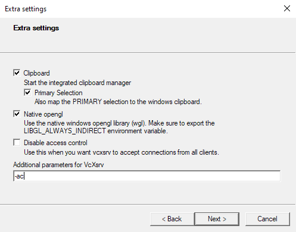

```{r setup, include=FALSE}
knitr::opts_chunk$set(echo = TRUE)
```

## 2.1 Overview

SLiM was built primarily with MacOS in mind, and so no native Windows version exists. However, since MacOS is very similar to many Linux distributions, we can use Windows 10's new Windows subsystem for Linux to run SLiM on Windows (or if we want to be pedantic, we're running SLiM on a Linux kernel running off Windows). The SLiM manual (SOURCE) has a pretty good step-by-step instruction for this if you want to run SLiM by itself, and not worry about using WSL for anything else. However, Linux is a fantastic base for many scientific applications, such as connecting to supercomputers, which are more often than not Linux-based. As such, I'll be guiding you through installing a desktop environment for WSL, installing R, Rstudio, and SLiM, and getting you up to speed with some basics of using Linux. For MacOS users, you can simply install SLiM using the installer package available [here](https://messerlab.org/slim/). There are also instructions in the SLiM manual for building SLiM from source for MacOS if you would prefer that. For Windows users not on Windows 10, I'm afraid there is no way at the moment to run SLiM "natively" on Windows - your best bet would be to dual boot a Linux distribution, or run a virtual machine with VirtualBox or VMware. 

::::{.extrabox data-latex=""}
:::{.center data-latex=""}
**Box 2.1.1**
:::

Linux (or any Unix based operating system) differs from Windows in the sense that absolutely everything is treated as a file - including devices like printers or monitors. These devices have specialised files that store information about that device. Programs can read those files (or write to them) to communicate with the device itself. Note that these aren't files in the sense that they are a .txt or something, but they are exposed to the filesystem and can be treated as different files depending on what commands you give it.

For example, you could enter 
```{bash files, eval=FALSE}
cat /proc/cpuinfo

```

or 

```{bash files2, eval=FALSE}
gedit /proc/cpuinfo
```

to print your CPU information to the terminal, or open the file with a text editor so it is readable.

You can also use various 'files' such as /dev/null or /dev/urandom to instruct other commands. Redirecting output from a command to /dev/null will silence the output so it isn't displayed in the terminal:

```{bash devnull}
slim ~/PolygenicSLiM/box2.1.slim # With output
```
```{bash devnull2}
slim ~/PolygenicSLiM/box2.1.slim > /dev/null # Output nullified
```

/dev/urandom will generate pseudorandom numbers:
```{bash devrandom}
od -d /dev/urandom | head # Generate random decimal integers
```

The power of having these very specific commands which can act on a lot of different types of files is that Linux users can chain together these commands to efficiently solve a larger problem.
::::

## 2.2 Installing WSL

There are two choices for running WSL: WSL 1 or WSL 2. Both are fairly similar in speed, however WSL 2 uses a real Linux kernel and an extremely fast virtual machine (along with a virtual hard drive), whereas WSL 1 used a translation layer (instead of a native kernel) to translate between windows and a linux distribution. Ultimately , the main difference is WSL 2 is slightly slower when it comes to copying files between Windows and Linux, but faster nearly everywhere else. Although both versions run SLiM fine^\*^, I'll be opting for WSL 2.


:::{.smallnote data-latex=""}
^\*^One bug I did find with WSL 1 was that Windows Security seems to treat a few programs running on Linux as something suspicious. The result is that Windows Security uses 50% or more CPU while those programs are running. SLiM is included in this, so if for whatever reason you use WSL 2, remember to turn off real-time protection during your SLiM runs and then *remember to turn it back on when the run is finished*.
:::


To install WSL, you'll need to be on Windows 10 version 1903 (build 18362) or newer. To check your version number, run winver.exe. This will tell you the version and build number (build number being in brackets).

Instructions for installing WSL 2 can be found on the Microsoft website [here](https://docs.microsoft.com/en-us/windows/wsl/install-win10). You'll want to install Ubuntu 20.04 LTS.

This will install your Linux distribution to the C:/ drive by defualt. If you have limited space on C:/ you can move it to an alternative drive, using [this](https://github.com/pxlrbt/move-wsl) tool. I recommend installing git bash on Windows and running it that way. A side effect of this is the default user is replaced by root (basically admin for linux) for some reason, but this is easy enough to fix. 
Open up /etc/wsl.conf with gedit and add the following to the end of the file:
``` {bash rootfix0, eval = FALSE}

gedit /etc/wsl.conf

# Add the following lines to the bottom of wsl.conf

[user]
default=YOUR_USERNAME
```
If wsl.conf doesn't exist, create the file manually. After you've added that line, close Ubuntu, then in PowerShell run: 

```{powershell wslterminate, eval = FALSE}
wsl -terminate Ubuntu
```

When you next open Ubuntu, you should login as your user again. If that doesn't work, open up PowerShell and enter:
``` {powershell rootfix, eval = FALSE}
ubuntu config --default-user YOUR_USERNAME
```

Congratulations! You now have a working version of Ubuntu 20.04 LTS running via Windows 10.


## 2.3 Installing a desktop and setting up X11

At this point you have a Ubuntu terminal which you can use to input commands. This is perfectly usable (even with a desktop you'll be using the terminal quite a bit), but you'll probably want a desktop environment to be more comfortable.
To do this, enter the following:

``` {bash gnomeinstall1, eval=FALSE}
sudo apt-get update # Refresh Ubuntu's list of software updates
sudo apt-get upgrade # Download and install package updates
sudo apt install ubuntu-desktop gnome
```

::::{.extrabox data-latex=""}
:::{.center data-latex=""}
**Box 2.3.1**
:::
You can copy and paste commands from the Terminal using Ctrl+Shift+C and Ctrl+Shift+V.
::::

The first two commands will update your base installation and packages; the third will install GNOME (a Linux desktop environment) and relevant dependencies. 

While those files are downloading, you'll need to grab a X11 program for Windows. X11 is how Linux draws graphics, so we need that so that when you run GNOME, Linux has somewhere to draw those graphics. I recommend [VcXsrv](https://sourceforge.net/projects/vcxsrv/), which is easily configurable.

After downloading and installing VcXsrv and GNOME, there's a little workaround to get it working on WSL.
In the Ubuntu terminal enter the following:

```{bash bashrc, eval = FALSE}
sudo nano ~/.bashrc # Open up .bashrc in the nano text editor

# .bashrc contains commands that run on startup
# Add this one to the bottom of the file in nano and press ctrl+o to save and ctrl+x to exit

export LIBGL_ALWAYS_INDIRECT=0

```

This has something to do with how Linux handles OpenGL graphics drivers, but that's about as much depth into it as I can go. Without doing this, SLiMgui doesn't render properly.
Next, there's a setting that needs to be enabled which defaults to disabled in WSL. In WSL 1, this broke a lot of programs (particularly compilers), but it seems to work fine in WSL2. 
In Terminal, enter:
```{bash systemd, eval = FALSE}
git clone https://github.com/DamionGans/ubuntu-wsl2-systemd-script.git
cd ubuntu-wsl2-systemd-script/
bash ubuntu-wsl2-systemd-script.sh
logout
```

Now your Ubuntu window should close. Again, go to PowerShell and terminate Ubuntu:
```{powershell wslterminate, eval = FALSE}
```

Next, open up VcXsrv. You should be greeted with a panel that looks something like this:


Choose "One large window" and click next, and then next again.
At this dialogue, in additional parameters type -ac


After pressing next, you should be done! You can save your configuration to create a shortcut that will open VcXsrv with your settings. 


Click Finish and VcXsrv will open a blank window. Open ubuntu and enter:
```{bash startgnome, eval = FALSE}
gnome-session
```

In a few seconds your VcXsrv window should be populated! 


Now you might notice that your desktop doesn't look exactly like my example above. GNOME is quite customisable, and a plethora of user extensions to personalise your desktop. I won't cover that here, but I would recommend checking out the [GNOME extensions website](https://extensions.gnome.org/), and searching around for some GNOME themes. One extension I do recommend installing is nautilus admin, which will allow you to right click in any folder to open a terminal there - a great convenience!

```{bash nautilusadmin, eval = FALSE}
sudo apt install nautilus-admin

# An alternative if that doesn't work is

sudo apt install nautilus-extension-gnome-terminal
```


## 2.4 Building SLiM

There's a few ways of going about building SLiM. We'll be following the Linux/Unix installation instructions (Chapter 2.2.1) in the [SLiM manual](http://benhaller.com/slim/SLiM_Manual.pdf). First, install the following packages:
```{bash slimdepen, eval = FALSE}
sudo apt-get update
sudo apt install -y build-essential cmake qt5-default qt5-qmake mesa-utils
sudo apt install -y libgl1-mesa-glx x11-apps
```

After this, you should have all the dependencies you need to run the installation script mentioned in the manual:
```{bash sliminstall, eval = FALSE}
wget -o - --quiet https://raw.githubusercontent.com/MesserLab/SLiM-Extras/master/installation/DebianUbuntuInstall.sh | sudo bash -s
```

This will download and install SLiM, Eidos, and SLiMgui on your system.
You should be able to find SLiMgui in your applications now, and you'll have something looking like this:


## 2.5 Installing other useful apps

When using SLiM, you'll need some more apps to run SLiM on remote computers and to analyse data.
I recommend installing FileZilla, which will help copy files across from your computer to a remote supercomputer:
```{bash installfile, eval = FALSE}
sudo apt install filezilla
```

For analysis, I recommend installing R, which is a tiny bit more involved.
```{bash installr, eval = FALSE}
cd /etc/apt
sudo gedit ./sources.list

# Add the following line to sources.list

deb https://cloud.r-project.org/bin/linux/ubuntu focal-cran40/
```

Then, in terminal enter the following:
```{bash installr2, eval = FALSE}
sudo apt update
sudo add-apt-repository 'deb https://cloud.r-project.org/bin/linux/ubuntu focal-cran40/'
sudo apt-key adv --keyserver keyserver.ubuntu.com --recv-keys E298A3A825C0D65DFD57CBB651716619E084DAB9
sudo apt install r-base r-base-core r-recommended r-base-dev
```

This will install the latest release of R 4.0, along with some packages.
Next, we can install RStudio: you can choose to install it as an app or as a server, which you can connect to via your internet browser in both Windows and Linux. With some more set up, you could also remotely connect to it via the internet, but I'll leave that for later. 

To install RStudio as an app: 
```{bash installrstudio, eval = FALSE}
sudo apt install gdebi-core

wget https://download1.rstudio.org/desktop/bionic/amd64/rstudio-1.4.1103-amd64.deb && sudo gdebi rstudio-1.4.1103-amd64.deb
```

Then you can run `rstudio` to open the app.

To install RStudio as a server app:
```{bash installrstudio2, eval = FALSE}
wget https://download2.rstudio.org/server/bionic/amd64/rstudio-server-1.4.1103-amd64.deb
sudo gdebi rstudio-server-1.4.1103-amd64.deb
```

Launch RStudio by running `rstudio-server start`, and stop the the service with `rstudio-server stop`.
The default settings allow you to connect to the server using whichever browser you'd like with the url
`localhost:8787`. You'll have to login using your Linux username and password. Note that this server is running on your local machine, so to connect to your server on a different network, you'll have to do some network configuration (namely port forwarding and setting a static IP).

When you have RStudio running (or R if you are just running from the Terminal using `R` like a madman), you can use `install.packages("PACKAGE_NAME")` to install packages. Necessary packages will be detailed in later chapters when we get to needing them. To start, try `install.packages("tidyverse")`.

Congratulations! You now have a Linux Desktop, SLiM, RStudio, and FileZilla installed and ready to go for exploring polygenic adaptation using computer simulations!
 and FileZilla")
