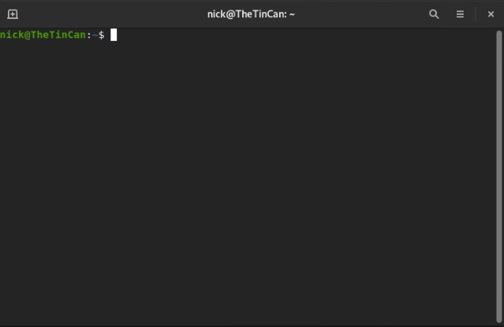
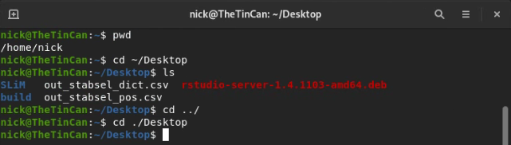
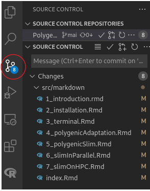
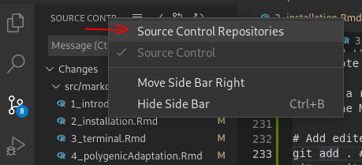

# Terminal Shortcuts and Basics

## Overview

One major difference between Windows/Mac and Linux operating systems is that it's necessary to learn how to use a command prompt 
(called the terminal) to use the operating system. You've already done a bit of that when you were installing Ubuntu and Gnome, 
but now I'll show you some of the most useful commands for navigating directories via the terminal, installing and updating your software, 
manipulating text files, and what programs you'll likely use for various tasks.

## Navigating folders

When you open a terminal emulator in Gnome, you'll be met with a screen that looks something like this:


Notice the start of the line: this tells you whereabouts in the filesystem you are. By default, when you open a terminal you'll 
start at the root directory: the first folder that contains all other folders and files within it. To check your current working 
directory, type `pwd` (print working directory). Lets go to our Desktop directory. To do that type `cd ~/Desktop`. The `~` character 
tells linux that the directory you are looking for is a branch off of home. Since opening a new terminal defaults you to the home directory, 
an alternative to do the same thing is `./Desktop`. `./` tells linux that the directory is a branch off of the current directory 
(the one shown with `pwd`). Now let's list what's on our Desktop using the `ls` command. To go back to your home directory (Desktop's parent directory), 
type `cd ../`.



Now lets say we want to create a directory. We can use the `mkdir` command for that. Go back to your desktop and enter: 
`mkdir Cool_Folder`. 
On your Gnome desktop, you should see that folder appear. If we want to create folders within folders, we can use the 
recursive flag with `mkdir`, as follows:
`mkdir -r Cool_Folder/Cooler_Folder`

Now say we want to make a folder, and then enter it immediately after. We can do this a number of ways. 
You could simply call `cd` as a second command, but you can also use `&&` to chain together commands, like so:
`mkdir -r Cool_Folder/Cooler_folder && cd ./Cool_Folder/Cooler_folder`

If you ever want to learn about the flags that are available for a certain command, you can enter `man command_name` 
to view the manual, or `command-name --help` to view a usually shorter list of available options.


:::: {.extrabox data-latex=""}
::: {.center data-latex=""}
**Box 3.2.1**
:::
Say you want to make a directory and then enter it immediately rather than having to chain together commands or 
enter them one at a time. You can do that by creating a custom command and putting it inside your /home/.bashrc file 
(courtesy of Ouki on [Stack Overflow](https://unix.stackexchange.com/questions/125385/combined-mkdir-and-cd)):

```bash
mkcdir ()
{
  mkdir -p -- "$1" &&
  cd -P -- "$1"
}
```
::::


## Installing and updating software

With Ubuntu, you don't need to worry about Windows updates taking your computer hostage whenever it feels like it. 
However, it is on you to keep your software updated (or not, if you need a particular version of some software!).
To update all the packages you have installed, run the following:

```bash
sudo apt-get update
sudo apt-get upgrade
```

`sudo` is like 'Run as Administrator' in Windows, and allows programs to gain root access (access to non-user 
directories like where most of your software is installed). `apt-get update` updates the list of Ubuntu-supported 
packages you are able to install directly via Ubuntu. `apt-get upgrade` downloads those latest versions of the 
Ubuntu-supported packages you have installed and updates them for you. 
Before installing new software using `apt-get`, it's always a good idea to run `apt-get update` to make 
sure you're downloading the latest version.

Now lets say we want to download a new program - like fortune, a little program that shows a quote on the screen.

```bash
sudo apt-get update
sudo apt-get install fortune-mod
```
If you don't know the full name of a package (or how to spell it), you can press tab to autocomplete your line, 
or double-press tab to give a list of all the possible packages available matching what you've typed so far. 
This works for anything in terminal, and is extremely useful, especially when cd'ing to a directory: rather than 
typing out the whole directory, you can usually hit tab a few times, type a few letters and hit tab some more to 
get to where you want. Much faster!

`apt-get install` also works with multiple packages at once. For example,

```bash
sudo apt-get update
sudo apt-get install fortune-mod cowsay
```
This will install both fortune-mod and cowsay (a program that draws an ASCII animal with a speech bubble saying whatever you type).

Now that your programs are installing, you can try them out!

```bash
fortune

cowsay "I don't think, therefore I don't am."
```

```
## Q:	What did Tarzan say when he saw the elephants coming over the hill?
## A:	"The elephants are coming over the hill."
## 
## Q:	What did he say when saw them coming over the hill wearing
## 		sunglasses?
## A:	Nothing, for he didn't recognize them.
##  ______________________________________
## < I don't think, therefore I don't am. >
##  --------------------------------------
##         \   ^__^
##          \  (oo)\_______
##             (__)\       )\/\
##                 ||----w |
##                 ||     ||
```


:::: {.extrabox data-latex=""}
::: {.center data-latex=""}
**Box 3.3.1**
:::
As I've alluded to with the tab shortcut, the Linux terminal has many useful shortcuts that can save a lot of time.
I'll describe a few below:

| Shortcut         | Function                                                              |
| ---------------- | --------------------------------------------------------------------- |
| Ctrl + Alt + T   | Open a new terminal                                                   |
| Ctrl + C         | Cancel the current command                                            |
| Ctrl + L         | Clear the terminal of all output                                      |
| Home             | Move to the beginning of the line                                     |
| End              | Move to the end of a line                                             |
| Ctrl + U         | Clear the line                                                        |
| Ctrl + Shift + - | Undo                                                                  |
| Ctrl + Shift + C | Copy                                                                  |
| Ctrl + Shift + V | Paste                                                                 |
| Ctrl + R         | Recall the last command you entered with the characters you provide   |
| !                | Run the last command again                                            |

Similarly, rather than typing out entire directories every time, you can use some special characters to get some of the way there:

| Character | Location       | Example                               |
| --------- | -------------- | ---------                             |
| ~         | Home directory | ~/Desktop                             |
| .         | Current directory | ./ChildDirectoryofCurrentDirectory |
| ..        | Parent directory | ../build                            |
| /         | Root directory | /bin                                  |

And here are a number of some really helpful commands that you'll likely be using often. I'll only be showing 
you the base cases here: often there are a number of options you can enable to do different things 
(e.g. recursively make directories with mkdir -r), but to see the available options all you need to do is 
look for the command's manual page with `man <command>`

| Command  | Description                                                              | Example                             |
| -------- | ------------------------------------------------------------------------ | ----------------------------------- |
| cat      | Concatenante/display a file's contents in terminal                       | cat ~/.bashrc                       |
| cp       | Copy a file/folder to another folder                                     | cp ~/file.txt ~/Desktop             |
| mv       | Move a file/folder to another folder                                     | mv ~/file.txt ~/Desktop             |
| rm       | Remove a file/folder (delete)                                            | rm ~/file.txt                       |
| alias    | Assign a string of commands another command name                         | alias cowfort="fortune \| cowsay"   |
| curl     | Fetch a file from the internet (not pre-installed; alternative to wget)  | curl https://github.com/nobrien97/PolygenicSLiMBook/blob/main/src/SLiM/box2.1.slim -o box2.1.slim |
| grep     | Search a file's lines for a particular pattern                           | grep hello ~/file.txt               |
| sed      | Modify text coming in from stdin. Combine with grep for powerful editing | [See here](https://www.digitalocean.com/community/tutorials/the-basics-of-using-the-sed-stream-editor-to-manipulate-text-in-linux) |
| top      | Display info on active processes, CPU and memory usage etc.             | top                                  |
| head     | Display the first few lines of a file                                   | head ~/multilinefile.txt             |
| tail     | Display the last few lines of a file                                    | tail ~/multilinefile.txt             |
| tar      | Bundle files into an archive (compressed with -j or -z)                 | tar -cg Files.tar.gz ~/FolderOfFiles |
| ssh      | Connect to a remote server                                              | ssh user@tinaroo1.rcc.uq.edu.au      |
| shutdown | Shuts the Linux system down in one minute (now for immediate)           | shutdown now                         |
| less     | Open and read a file (press q to exit)                                  | less ~/file.txt                      |
| vim      | Powerful terminal text editor with steep learning curve                 | vim ~/file.txt                       |
| nano     | Considerably more user friendly text editor                             | nano ~/file.txt                      |
| gedit    | Another text editor, this time exists out of the terminal               | gedit ~/file.txt                     |
| history  | Display history of commands in the terminal. Rerun any of them with !CommandNumber | history && !! && !3       |
::::

## Input and output

Linux programs are written in such a way that programs take their inputs and spit out their outputs in a standardised way. 
This means that you can use the same command or tool to affect many different programs' outputs or inputs with the same 
syntax. This is done through input and output 'channels'. The main ones are standard input (stdin), 
standard output (stdout), and standard error (stderr). You might also see these referred to as file descriptors. 
Programmers can write code to send their output to stdout (and error messages to stderr) to avoid having to implement 
their own system. If they require addition functionality, they can create their own channels as well. For more on 
input/output and file descriptors, see [this video](https://youtu.be/2xlk4bSPG38?t=2544).

By default, stdin takes the input of what the user types in the terminal, and stdout (and stderr) prints everything 
to the terminal. This behaviour can be changed by using pipes and redirection, making these input/output streams 
very powerful indeed. One consequence of this is we can chain together commands, feeding their output into another 
command. Take this example:


```bash
fortune | cowsay
```

```
##  _________________________________________
## / You have a strong appeal for members of \
## \ your own sex.                           /
##  -----------------------------------------
##         \   ^__^
##          \  (oo)\_______
##             (__)\       )\/\
##                 ||----w |
##                 ||     ||
```

Here, we use the `|`, called the 'pipe', to 'pipe in' fortune's stdout into cowsay's stdin. The result is a cow
with a textbox (`cowsay`) relaying a quote from `fortune`.

You can also save the output of a command to a file using redirection `>`
Take this example:


```bash
echo "Hello, world!" > ~/Desktop/file.txt
```

Redirection is in particular very important in general, and will be used pretty extensively to copy files to 
the proper place, append files with new lines of results from SLiM, and interface with supercomputers (all coming later!). 
For that reason, I strongly suggest watching this [10 minute video](https://www.youtube.com/watch?v=mV_8GbzwZMM) on 
all the common redirection and piping methods available so when you see it in future (or need to use their functionality!) 
you know what you're looking at.

## Git 

Git is a version control software which allows you to maintain a working history of your files. It's most useful with plaintext files, 
such as code, where you can directly view the differences between an older version of a file and the current version. In large projects it is vital,
but even in small projects with only a few files, version control is very important for organisation, and being able to keep track of your work
easily. If you want to test out a change but you are unsure if it will work, Git allows you to do that while always being able to go back
to your old version if required. You could save a backup file somewhere, but this is clunky, prone to error, and hard to maintain over time.
Git can be a bit confusing to start out, but because of its ubiquity there is a massive amount of information available. Simply googling
what you are trying to do will likely get you in the right direction. I would also highly recommend following [GitHub's tutorial to create your
first repository](https://guides.github.com/activities/hello-world/), and also checking out [Atlassian's git tutorials](https://www.atlassian.com/git/tutorials/setting-up-a-repository).

To save your data online, Git has a feature called 'remotes'. You can have a local git repository/folder to keep track of your files, 
and then a remote repository that you and/or others can access from the internet. You can update your files locally, and when you want to 
update the version on the cloud you 'push' them to your remote repository. There a few services which host remotes, but the most used is GitHub.

Git is a command line tool, however it is directly integrated into a variety of software. Both RStudio and VS Code have git support, for instance.
Because of this, you will rarely have to use the command line to use git.
Nonetheless, there are a few command line options you should know about in case something isn't working for you with these programs' integration.


```bash
# Make a new Repository
mkdir ~/MyRepositoryFolder
cd ~/MyRepositoryFolder
git init MyRepository 
git add * # add all files that git init generates to the repository
git commit -a -m 'Initial commit' # commit all files to the repo with message 'Initial Commit'

# Link a repository to a remote (create a new remote at [GitHub](https://github.com/new))
git remote add origin https:/github.com/UserName/MyRepository.git

# Clone a repository (easiest way to make a new repo: create on GitHub, then clone that into a local folder)
git clone MyRepository https:/github.com/UserName/MyRepository.git

# Add edited/new files to your repository
git add . # '.' to add all edited files in the folder, you can alternatively specify particular files
git commit # This will open up a text editor asking for your commit message
git push # This will push your commit to the remote 

# Remove files from the repository, recursively and forcefully
git rm -rf ./AwfulFile.c
git commit

```

In VS Code,the sidebar has a 'Source Control' tab that will allow you to link a repository and/or a remote. 
If you load VS Code from within a repository, i.e. `cd ~/MyRepository; code .`, it will do this automatically,
assuming you already have a remote linked.



This tab will keep track of the changes you've made in the local repo, with options to 'stage changes' (`git add`),
commit, and push to a remote, although the remote is hidden by default and will require you to right click on the 
'Source Control' header and tick the 'Source Control Repositories' flag:



You might find that some files won't automatically add themselves to the 'Changes' list in VS Code, in which case you'll have
to click the 'Refresh' button next to 'Source Control'. If this doesn't work, you'll have to do it in command line.
I find that VS Code is generally good at keep track of existing files, but not very good at keep track of the folder itself:
that is, removing files and adding files generally won't be picked up by VS Code, so you'll need to directly add them through
the command line with `git add .`.

### Git Branches and Pull Requests

Sometimes you'll want to change a heap of files at once in your git repository, and going back to the original state
if it doesn't work would be a massive pain. Alternatively, you might want to have a separate files organised in a separate
'partition' of your repository. You might also be collaborating with others, in which case you don't want to be constantly
overwriting each others' work (although Git does automatically merge files with changes on different lines, if you are editing
the same file on the same line, some decisions need to be made as to which version to keep). This is where branches come in. 
A branch is a splitting off point from your repository. You can imagine your repository as a phylogeny: over time, the files
change, and branches are created at various points in time creating new, distinct edits. The idea is you can preserve your
main repository's files, work on an experimental branch, and then either abandon it if it doesn't work, or merge it into 
your main branch using a 'pull request'. If you're collaborating, you can create your own branch so as not to disturb other
collaborators, and when you are done, you can create a pull request to pull your branch into the main one. You can also 
use branches to organise your repository into categories: for example, R bookdown repositories often have a separate branch
for hosting the .html website, and another for storing markdown documents, uncompiled code, and data not relevant to the
bookdown itself.

[](https://www.atlassian.com/git/tutorials/using-branches)
From https://www.atlassian.com/git/tutorials/using-branches

To create a new local branch and link it to a new remote branch, you can use the following commands:

```bash
git branch NewBranch # Create the new local branch
git checkout NewBranch # Swap to the new local branch
git push NewRemoteBranch NewBranch~ # Create a new branch on the remote called NewRemoteBranch
```

To view all of the branches available on your project, you can run `git branch` with no arguments. 

Most of the time, branches aren't super necessary. They do have their uses, but I wouldn't recommend creating a heap of 
branches for every experiment you want to do: you can always use `git reset` to reset your repo to a certain commit.
Similarly, pull requests are only necessary if you're collaborating and need to have code approved. For more information
on that, I'd recommend checking out [Atlassian](https://www.atlassian.com/git/tutorials/making-a-pull-request).

### Git for SLiM

I find Git very helpful for maintaining SLiM code. Particularly when playing around with input variables and adding new features,
it can be useful to keep track of what is made. However, the main feature I like is the cloud backup which is always available at 
GitHub. 
