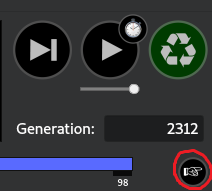
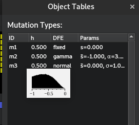

# Polygenic Adaptation in SLiM

## Overview

In this chapter I'll provide a number of templates aiming to reconstruct some of the polygenic models we have seen in SLiM. 
I've aimed to make these templates highly customisable, with many features that can be adjusted as you see fit. 
As such, I'll break down each section of the code to explain what it does, which may give you ideas for how it could be extended for your own use cases, 
or which parts can be removed if you don't need them and want to maximise your speed and/or minimise memory use.


## A Single Polygenic Trait (Chp5-1_1T.slim)

The first example we'll go over models a single polygenic trait evolving through either drift, stabilising selection, or directional selection. 
This template has been built to be very broad, with a large array of parameters. These parameters are defined at the top of the file - 
any line beginning with ```SetCfgParam()``` is a different parameter you may adjust$^*$. The defaults are set based on realistic values, with sources 
cited in comments. See Box 5.2.1 for information on each of these parameters.

$^*$ : ```SetCfgParam()``` is based on the SLiM function ```defineConstant()```, but works for both command line and SLiMgui so no changes are
       necessary to switch between the two.

The model begins with a specified number of generations of burn-in (given via the parameter ```burnTime```). 
This burn-in period involves mutations subject to neutral drift, which yields standing genetic variation for selection to act on when a fitness function 
is applied. The idea is for the population to be at mutation-drift equilibrium by the time the selection regime is applied. 
I've found this typically occurs within 50,000 generations for a population size of 8,000, but you'll likely want to adjust this as you see fit. 
One way to confirm when a population is at equilibrium is by tracking heterozygosity over time. In the SLiM script (Chp5-1_1T.slim) you can 
do this by setting ```SetCfgParam(printH, T);``` (Line 36). This will plot heterozygosity over time during your set burn-in period for you to view. 
When the population is at equilibrium, this value should remain relatively stable around $\theta = 4N_e\mu$, however the amount of stability around 
this value (or any value at all) is dependent on several parameters including linkage (given by ```rwide```), and background selection 
(determined by ```del_mean```, ```del_shape```, and ````mutWeights```). During burn-in, a variety of output files are generated. 
These include files containing
- Information on which genome positions are QTLs as opposed to non-QTL sites
- Heterozygosity and phenotypic means over time (sampled every X generations, defined by the first value in ```samplerate```).
- The phenotypic location of the trait optimum.

Following burn-in, a certain selection regime takes place for a specified number of generations. This is set using the ```selType``` and 
```testTime``` parameters. Here, the population follows a stabilising or directinal selection trajectory, or continues via neutral drift 
("Brownian motion"). During this process, some more output is generated:
- Information on heterozygosity, phenotypic means, and fitness (sampled at a rate fiven by the first value in ```samplerate```)
- Allelic effect sizes, frequencies, fixation times, etc. (sampled at a rate given by the second value in ```samplerate```)

Note that mutation output is quite large (seeing as it stores many lines every time it writes to file), so you will want to adjust the sampling 
frequency as per your available storage, the size of your simulation (in number of generations, size of the genome, number of mutations/mutation rate etc.).

## Parameters

The script template contains a lot of parameters. Some of these will be applicable to you, others won't be. I'll explain each of them 
here so you can get an idea. In brackets next to the parameter name is the type it expects, and how many arguments it expects (if > 1).

| Parameter (type)                                  | Description                                                                                                  |
| ------------------------------------------------- |--------------------------------------------------------------------------------------------------------------|
| mu   (float)                                      | Genome-wide mutation rate                                                                                    |
| Ne    (int)                                       | Population size                                                                                              |
| del_mean and del_shape (float)                    | Mean and shape parameters used to pull effects of deleterious mutations                                      |
| mutWeights   (float, 3)                           | Proportions of mutations of different types                                                                  |
| rwide    (float)                                  | Genome wide recombination rate                                                                               |
| nloci  (int)                                      | The number of QTLs to model                                                                                  |
| genomelength (int)                                | The total length of the genome in loci                                                                       |
| locimu, locisigma, locidist (float, float, string)| Parameters for QTL distribution of additive effects.                                                         |
| width (float)                                     | Stabilising selection fitness function width parameter                                                       |
| opt   (numeric)                                   | Position of the optimum relative to the burn-in phenotype mean                                               |
| selType   (string)                                | The type of selection to use during the test: "s" = stabilising, "p" = positive/directional, "d" = drift     |
| printH (bool)                                     | Draw a graph of heterozygosity during burn-in to diagnose mutation-drift equilibrium                         |
| burnTime (int)                                    | Number of generations to run neutral burn-in for.                                                            |
| testTime (int)                                    | Number of generations to run the selective regime for.                                                       |
| samplerate (int, 2)                               | How often, in generations, to save output                                                                    |
| out... (string)                                   | Output filenames and paths for various output files                                                          |
| modelindex (int)                                  | Identifier for Latin Hypercube job arrays                                                                    |

Below are some tips regarding some of the parameters to guide you in designing your experiments:

### Ne
The single most expensive thing to do in SLiM is increase the population size. Be careful with setting this and time your 
simulations as you adjust it so you can maximise your population size for the available time you have to run your simulations. 
Be aware that smaller population sizes = stronger drift, and so selection will be comparatively weaker in small populations.

### del_mean and del_shape
When mutations appear in SLiM, a fitness effect is pulled from a user-specified distribution of fitness effects. 
Individuals with the mutation have their fitness adjusted according to this effect. Non-trait deleterious mutations are pulled 
from a gamma distribution in this simulation, which asks for a mean and shape parameter. This is slightly different to the 
standard mathematical notation, which usually specifies a $\alpha$ and $\beta$ parameter. In this case, the mean is equal to 
$\alpha\beta$, and the shape parameter is $\alpha$. You are able to see the shape of your distribution of effects for any mutation 
type by clicking the hand underneath the generation counter in SLiMgui and hovering over the mutation type:

 


### mutWeights
In this simulation, not all genome positions are QTLs. Some are sites with nothing to do with the trait whatsoever. 
Therefore, there are 3 mutation types: neutral (m1), which do nothing except give an idea of how linked variation 
declines with other types; non-trait deleterious (m2), which act as a form of background selection: imagine these as 
being mutations that don't affect the trait but reduce fitness; and QTLs (m3), which affect the trait. All three of 
these types can occur at a QTL _site_, but QTL _mutations_ (m3) cannot occur at non-QTL _sites_. Imagine a mutation 
occurs at a QTL that causes a pleiotropic effect elsewhere, resulting in an extremely deleterious effect. This is the 
kind of situation this is modelling. Similarly, a neutral mutation could occur at a QTL _site_ that is synonymous, 
not changing the phenotype at all. 
In this simulation, all mutations begin life as an m1 mutation. The simulation checks if any mutation exists at a QTL site 
and then randomly chooses a type based on ```mutWeights```. This parameter specifies the relative likelihood of a 
given mutation type (neutral vs QTL vs deleterious) occurring.

### rwide
From my experience, recombination rate in SLiM doesn't typically affect performance too much when using realistic values. 
However, if you want to model independent assortment (by setting ```rwide``` to 0.5) to get rid of linkage effects, 
you will probably see a tiny$^1$ performance drop$^2$. I'd suggest testing this out, and if you want to model independent 
assortment, do so with a small genome (or a small population). This parameter is set as a single genome-wide value, however 
recombination maps can be constructed in SLiM using a vector of rates followed by a vector of endpoints where the next rate 
begins. This will require some small adjustments to the script, but should be trivial given you read the documentation on the
```initializeRecombinationRate()``` method.

<font size = "1">$^1$: Massive

$^2$: Death of your computer</font>

### genomelength
This simulation assumes each 'box' in the SLiM genome is a locus rather than a base pair. This means all rates (rwide, mu etc.) 
are scaled according to per locus per generation, rather than per base pair. ```nloci``` specifies the number of QTL positions 
to be randomly scattered across the genome, whereas genomelength is the actual genome length in total loci.
Hence, ```nloci``` must be $<=$ ```genomelength```.

### locimu, locisigma, and locidist
QTL mutations effects are pulled from a normal distribution by default in this simulation, with mean = locimu and variance = locisigma. 
This can be changed though, using the ```locidist``` parameter. A normal distribution (default) is set using "n". 
A gamma distribution of effects can also be chosen using "g". 


### width
The fitness function being used for stabilising selection comes from Lande 1976 (SOURCE).
This equation comes out to the form $f(z)\ =\ 0.01+\exp(-(z^{2})*\left(\frac{1}{2w^{2}}\right))$

Where f(z) is the fitness of an individual z units from the optimum, w is the width of the function, and z is the Euclidean distance from the optimum. 
You can play around with that [here](https://www.desmos.com/calculator/yelcak6wfo). Moving the width will show 
you how fitness decays as an individual gets far from the optimum: higher width means weaker selection 
(lower difference between individuals at the optimum vs those far away).

The ```width``` parameter is precomputed to save a little bit of computing time - computers don't like doing division 
very much, and doing that every time we calculate fitness is wasteful. 
Hence, we precompute $\frac{1}{2w^{2}}$, and that is our width parameter.

### printH
Setting this option to ```T``` will enable a diagnostic plot of heterozygosity over time to help visualise mutation-drift 
equilibrium for your given mutation rate and population size (see Section 5.2). Dotted lines drawn indicate 10% CIs of $\theta$, 
a measure of nucleotide diversity given by $\theta = 4N_e\mu$.

### samplerate
There are two values set in the ```samplerate``` parameter. The first value corresponds to ordinary outputs 
(means, heterozygosities etc.), which occur during burn-in and the test. The second value corresponds to mutation output, 
which is considerably large due to printing many lines per generation. As a result, you likely will need to sample mutations less 
frequently than other output in order to save space (and have your files openable in R without running out of memory).


### modelindex
```modelindex``` is an important parameter for Latin Hypercube sets of simulations, however we'll get into that later. 
For now, you can use it individually to quickly identify different simulations where you have changed a bunch of 
parameters (e.g. if you have three levels of ```rwide```, you could set three different ```modelindex``` values to 
identify those models. This is more useful when combined with interactions between multiple parameters). It can also be 
used as a proxy for all of your variables, saving considerable space when storing output. For example, you will only need
one column to identify the parameters which led to a result rather than a column for each parameter. This is particularly
input with regards to mutation output, which grows to potentially 100s of gigabytes in size.


